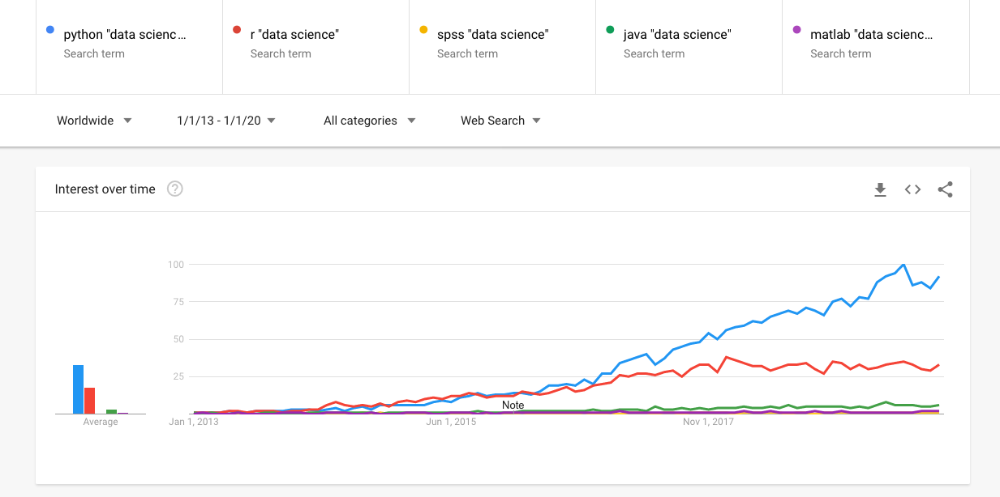

---
# YAML metadata
title: The importance of culture in open source
author: Matthew Brett
urlcolor: blue
colorlinks: true
---

# Open source culture

* Absurd ambition
* Persistence
* Enthusiasm
* Courage
* Friendship

# Hacker Heroes

\centerline{\includegraphics[height=2in]{images/Richard_Matthew_Stallman.jpeg}}

[Richard Stallman](https://en.wikipedia.org/wiki/Richard_Stallman)

* Give me back my printer
* [Lisp Machines Inc](https://en.wikipedia.org/wiki/Lisp_Machines) vs
  [Symbolics](https://en.wikipedia.org/wiki/Symbolics).
* Gnu Public License and copyleft

# Hacker Heroes

\centerline{\includegraphics[height=2.5in]{images/Linus_Torvalds_talking.jpeg}}

[Linus Torvalds](https://en.wikipedia.org/wiki/Linus_Torvalds)

> I decided just, how hard can it be? -- [Interview with LT](http://edition.cnn.com/TRANSCRIPTS/0003/11/mld.00.html)

# Scientific Python (and R)

# Python in science

# Genesis of Scientific Python

[How do the foundations get built?](http://asterisk.dynevor.org/how-do-the-foundations-get-built.html)

# As compared to

> New function interfaces undergo a rigorous design process that typically
> involves dozens to hundreds of developer-hours per function.

> MATLAB toolboxes offer professionally developed, rigorously tested,
> field-hardened, and fully documented functionality for scientific and
> engineering applications.

> MathWorks has over 250 full-time quality and test engineers who validate
> product quality and accuracy, and ensure the software passes extensive test
> suites before being released.

[Matlab vs
Python]https://uk.mathworks.com/products/matlab/matlab-vs-python.html, [Matlab
vs R](https://uk.mathworks.com/discovery/matlab-vs-r.html).

# Where?

[Where do the foundations get built?](http://asterisk.dynevor.org/who-is-building-the-foundations.html).

# Friendship

> We build this stuff by trusting each other as friends, and that is done on an
> international level.  Theo de Raadt [email to OpenBSD mailing list](http://marc.info/?l=openbsd-tech&m=129261032213320&w=2)

# Jupyter, Matplotlib, Fernando Pérez, John Hunter

[In memoriam John
Hunter](http://blog.fperez.org/2013/07/in-memoriam-john-d-hunter-iii-1968-2012.html)

# Passion

> I want to assume that we do this from love, that we care about each other,
> and that we welcome the crackle of real passion, real work, the real
> interaction of ideas. [Ron Jeffries: Passion](https://ronjeffries.com/xprog/articles/jatpassion)

# On culture

> I came to see, in my time at IBM, that culture isn't just one aspect of the
> game - it is the game (Louis V Gerstner, "Who says elephants can't dance?"
> p182)

# High-performance teams

> [High-performance teams] achieve beyond any measure of reasonableness, and
> they have fun doing it.  The finely developed sense of humor in these groups
> seems to distinguish them as well.  Not everything they do is laced with fun,
> and there may be some humorless high-performance teams out there.  But we
> doubt it. ("The wisdom of teams" by Jon R. Katzenbach and Douglas K. Smith).

# A view from over the hill

Find:

* Absurd ambition
* Persistence
* Enthusiasm
* Courage
* Friendship

wherever you can. Then go and work with those people. Move if you have to.

# What should we do?

How can we foster these virtues in our University?

# The Hacker Within

What next?

# Is this the end of the talk?

Yes, it is the end of the talk.
